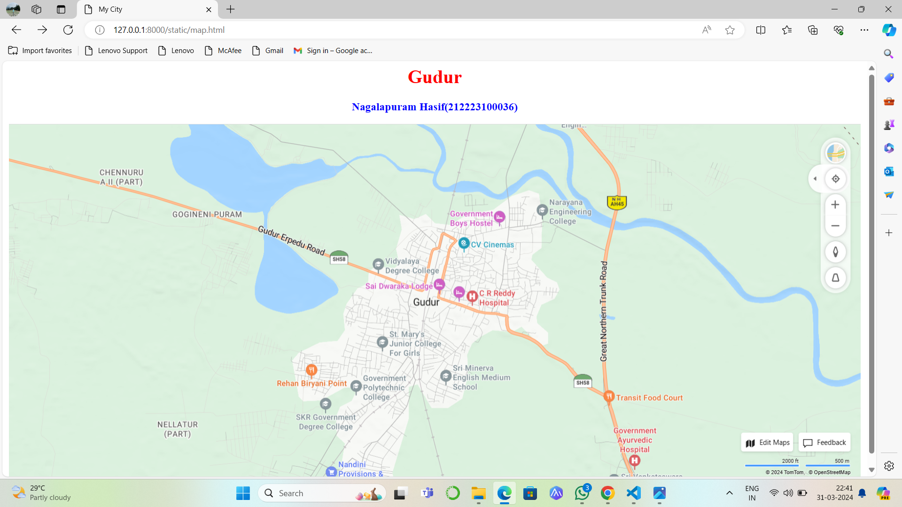
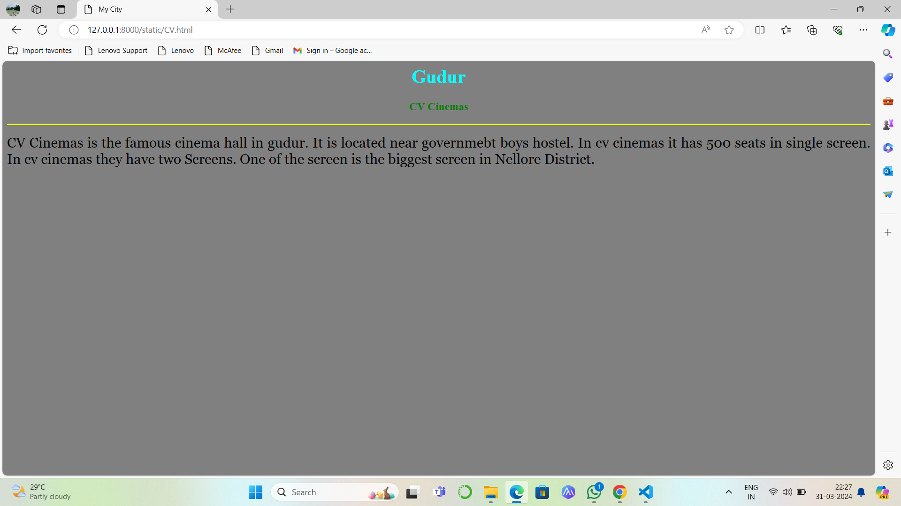

# Ex04 Places Around Me
## Date:  31.03.2024

## AIM
To develop a website to display details about the places around my house.

## DESIGN STEPS

### STEP 1
Create a Django admin interface.

### STEP 2
Download your city map from Google.

### STEP 3
Using ```<map>``` tag name the map.

### STEP 4
Create clickable regions in the image using ```<area>``` tag.

### STEP 5
Write HTML programs for all the regions identified.

### STEP 6
Execute the programs and publish them.

## CODE
```
map.html

<html>
    <head>
        <title>My City</title>
    </head>
    <body>
        <h1 align="center">
            <font color="red"><b>Gudur</b></font>
        </h1>
        <h3 align="center">
            <font color="blue"><b>Nagalapuram Hasif(212223100036)</b></font>
        </h3>
        <center>
            
            <map name="MyCity">
                <area target="" alt="Hospital" title="Hospital" href="C R Reddy.html" coords="698,365,913,496" shape="rect">
                <area target="" alt="College" title="College" href="St Mary's.html" coords="250,360,220,100" shape="circle">
                <area target="" alt="School" title="School" href="Sri Minerva.html" coords="700,250,600,300" shape="rect">
                <area target="" alt="Cinemas" title="Cinemas" href="CV.html" coords="580,300,50,50" shape="circle">
                <area target="" alt="Part" title="Part" href="Nellatur.html" coords="60,60,150,150" shape="rect">
                <area target="" alt="" title="" href="" coords="" shape="0">
    
            </map>
        </center>  
    </body>
</html>


Nellatur.html

<html>
    <head>
        <title>My City</title>
    </head>
    <body bgcolor="blue">
        <h1 align="center">
            <font color="cyan"><b>Gudur</b></font>
        </h1>
        <h3 align="center">
            <font color="red"><b>Nellatur</b></font>
        </h3>
        <hr size="3" color="red">
        <p align="justify">
            <font face="Georgia" size="5" color="black">
                Nellatur is the beautiful village in the Gudur mandal.
                It is located in Nellore district,Andhra Pradesh.
                In nellatur they has beautiful forest.
                In that forest different types of animals were living like deer,rabbit,dogs and etc.
                Near in this village it has beautiful lake.Every year different types f birds were come to this lake.
            </font>
        </p>
    </body>
</html>

CV.html

<html>
    <head>
        <title>My City</title>
    </head>
    <body bgcolor="gray">
        <h1 align="center">
            <font color="cyan"><b>Gudur</b></font>
        </h1>
        <h3 align="center">
            <font color="green"><b>CV Cinemas</b></font>
        </h3>
        <hr size="3" color="yellow">
        <p align="justify">
            <font face="Georgia" size="5" color="black">
                CV Cinemas is the famous cinema hall in gudur.
                It is located near governmebt boys hostel.
                In cv cinemas it has 500 seats in single screen.
                In cv cinemas they have two Screens.
                One of the screen is the biggest screen in Nellore District.
            </font>
        </p>
    </body>
</html>


Sri Minerva.html

<html>
    <head>
        <title>My City</title>
    </head>
    <body bgcolor="indigo">
        <h1 align="center">
            <font color="cyan"><b>Gudur</b></font>
        </h1>
        <h3 align="center">
            <font color="green"><b>Sri Minerva School</b></font>
        </h3>
        <hr size="3" color="yellow">
        <p align="justify">
            <font face="Georgia" size="5" color="black">
                Sri Minerva School is a famous school in gudur and near places for gudur.It is provided Nursery to 10th class.
                In secondary Education they score highest marks in 10th class and it is the top scorer in the Gudur village.
                They has Good Infra Structure.And they has a good building.
 
            </font>
        </p>
    </body>
</html>


St Mary's.html

<html>
    <head>
        <title>My City</title>
    </head>
    <body bgcolor="pink">
        <h1 align="center">
            <font color="cyan"><b>Gudur</b></font>
        </h1>
        <h3 align="center">
            <font color="green"><b>St Mary's School</b></font>
        </h3>
        <hr size="3" color="red">
        <p align="justify">
            <font face="Georgia" size="5" color="black">
                St Mary's College is the famous college in Gudur village.It has good infra structure.It has a good buildings.
                In this college they had a good faculty.The Faculty is very nice and they behaviour with students is very nice.
                It is the top most college and the education is very good.In this college Hostel maintainence is very nice.
            </font>
        </p>
    </body>
</html>


C R Reddy.html

<html>
    <head>
        <title>My City</title>
    </head>
    <body bgcolor="orange">
        <h1 align="center">
            <font color="cyan"><b>Nellore</b></font>
        </h1>
        <h3 align="center">
            <font color="lime"><b>C R Reddy hospital</b></font>
        </h3>
        <hr size="3" color="red">
        <p align="justify">
            <font face="Georgia" size="5" color="white">
                C R Reddy Hospital is one of the leading hospital in Gudur. 
                The best healthcare professionals provide Comprehensive healthcare. 
                It is located at near Bus stand. 
                It provides advanced levels of care in over different specialties including Oncologist, Cardiology, Orthopedic, Urology, Gynecology and Obstetrics.
            </font>
        </p>
    </body>
</html>


```

## OUTPUT






## RESULT
The program for implementing image maps using HTML is executed successfully.
